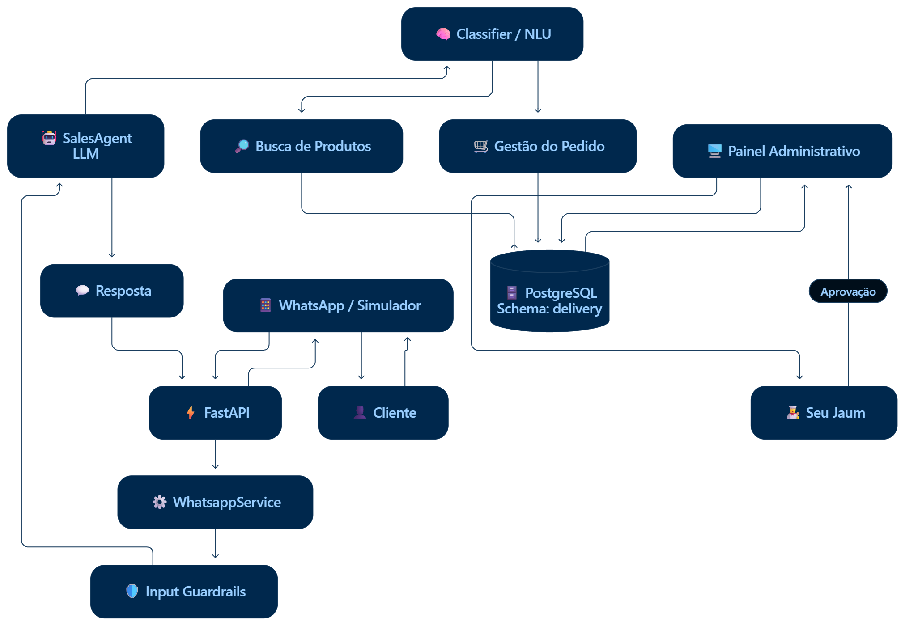
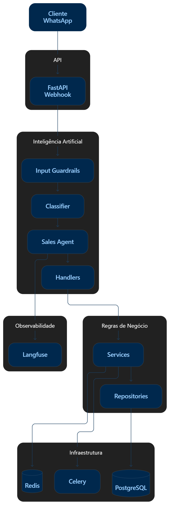
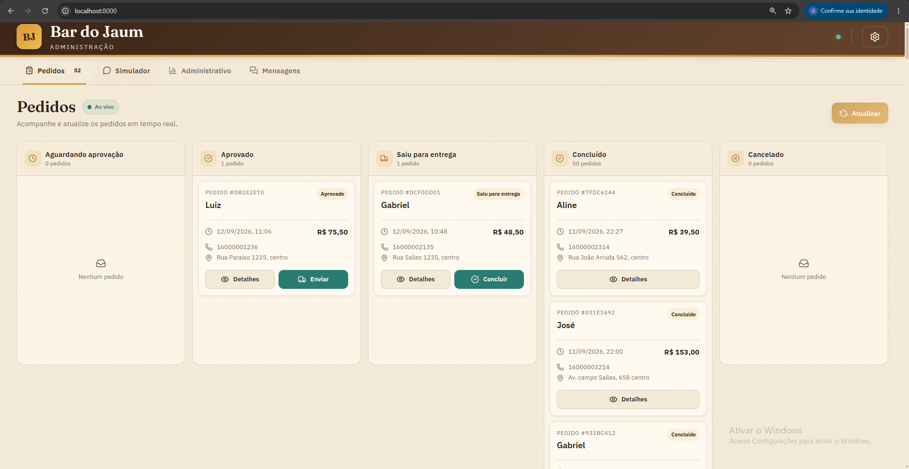
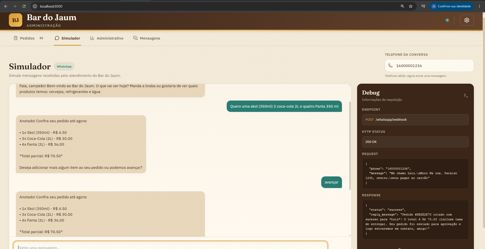
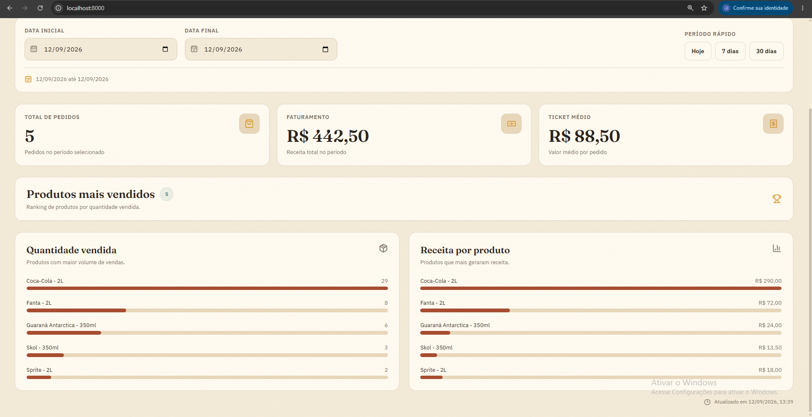
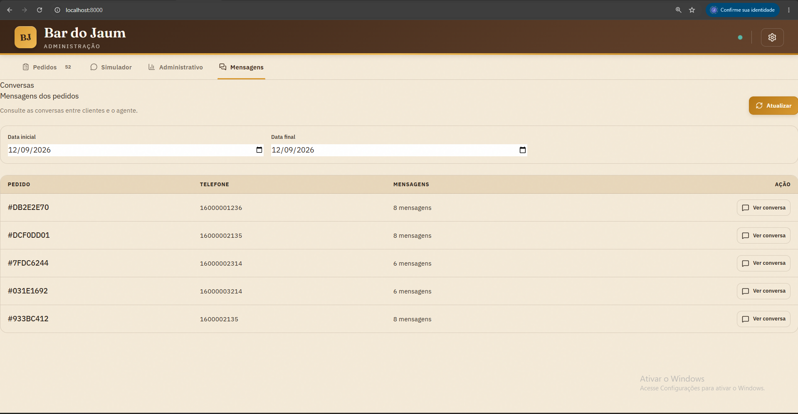

# Bar do Jaum

> **O LLM entende a conversa. O código decide o que pode ser feito.**

Agente de vendas conversacional desenvolvido para automatizar o atendimento de pedidos de bebidas, combinando **LLM, agentes de IA, guardrails, regras de negócio e aprovação humana**.

O projeto simula uma operação completa de delivery, desde a conversa com o cliente até o gerenciamento dos pedidos e acompanhamento das métricas.

---

## O problema

Um atendimento de delivery precisa interpretar mensagens naturais, consultar produtos, verificar estoque, montar pedidos e acompanhar seu status.

O desafio é permitir que a IA converse naturalmente sem entregar ao modelo o controle das regras críticas do negócio.

No Bar do Jaum:

```text
LLM
↓
Interpreta a conversa

Backend
↓
Aplica as regras

PostgreSQL
↓
Mantém os dados

Humano
↓
Aprova o pedido
```

---

## A solução

O cliente conversa naturalmente com o agente para realizar seu pedido.

A aplicação:

* interpreta a intenção do cliente;
* consulta o catálogo oficial;
* verifica produtos e estoque;
* conduz o fluxo da conversa;
* coleta os dados necessários;
* cria o pedido;
* aguarda aprovação humana;
* acompanha o status da entrega.

O fluxo principal do pedido é:

```text
PENDING
   ↓
APPROVED
   ↓
OUT_FOR_DELIVERY
   ↓
COMPLETED
```

Pedidos também podem ser cancelados enquanto estiverem em `PENDING` ou `APPROVED`.

---

## Onde a IA entra

A IA é responsável por interpretar a linguagem natural e conduzir a conversa.

Por exemplo:

```text
"Quero duas Heineken e uma Coca."
```

O agente interpreta:

```text
Produto: Heineken
Quantidade: 2

Produto: Coca-Cola
Quantidade: 1
```

Essas informações são posteriormente validadas pela aplicação contra o catálogo oficial.

O LLM não decide diretamente:

* preços;
* estoque;
* status do pedido;
* atualização de estoque;
* aprovação do pedido;
* regras críticas do negócio.

A responsabilidade fica separada:

```text
IA
↓
Interpretação

Código
↓
Validação e execução

Banco de dados
↓
Fonte de verdade
```

---

## Guardrails

Antes do processamento principal do agente, as mensagens passam por uma camada de proteção.

Os guardrails tratam:

* prompt injection;
* normalização de texto;
* solicitação de atendimento humano;
* gatilhos diretos;
* padrões de prompt injection em português e inglês.

A ideia é impedir que entradas inesperadas alterem o comportamento esperado do agente ou ultrapassem as regras definidas pela aplicação.

---

## Human-in-the-Loop

Pedidos não são aprovados automaticamente pelo LLM.

Para que um pedido possa avançar, é necessário possuir:

```text
customer_name
items
address
payment_method
```

Depois que os dados estão completos, o pedido permanece em `PENDING` aguardando aprovação humana.

```text
Cliente
   ↓
Agente
   ↓
Pedido completo
   ↓
PENDING
   ↓
Aprovação humana
   ↓
APPROVED
   ↓
OUT_FOR_DELIVERY
   ↓
COMPLETED
```

Essa abordagem mantém uma pessoa responsável pela decisão crítica da operação.

---

## Arquitetura

O projeto utiliza uma arquitetura de **monólito modular com FastAPI**, separando responsabilidades entre agentes, handlers, serviços, repositórios e persistência.



### Fluxo De Interação com o cliente


Fluxo principal:

```text
Router
   ↓
Service
   ↓
Repository
   ↓
PostgreSQL
```

O LLM interpreta a conversa, enquanto a aplicação controla as regras e operações críticas.

---

## Painel de administração

O projeto possui um painel para acompanhar e operar a aplicação.

### Pedidos

Tela destinada ao gerenciamento e acompanhamento dos pedidos.



### Simulador

Interface para simular a conversa do cliente com o agente, reproduzindo o fluxo de atendimento pelo WhatsApp.



### Administrativo

Área destinada ao acompanhamento das métricas da operação, com filtros por período e indicadores do negócio.



### Mensagens

Tela para visualizar as mensagens relacionadas aos pedidos, facilitando o acompanhamento e a rastreabilidade das conversas.



---
## Observabilidade

O projeto utiliza **Langfuse** para observabilidade das interações com o LLM.

São acompanhados dados como:

* traces;
* tokens utilizados;
* latência;
* chamadas ao modelo;
* custo das execuções.

Isso permite analisar o comportamento do agente e acompanhar o consumo da aplicação.

---

## Stack

| Categoria                     | Tecnologia             |
| ----------------------------- | ---------------------- |
| Linguagem                     | Python 3.13            |
| API                           | FastAPI                |
| LLM                           | Groq                   |
| Modelo                        | `openai/gpt-oss-120b`  |
| Banco de dados                | PostgreSQL             |
| Sessão                        | Redis                  |
| Processamento assíncrono      | Celery                 |
| Observabilidade               | Langfuse               |
| Frontend                      | HTML, CSS e JavaScript |
| Templates                     | Jinja                  |
| Containers                    | Docker                 |
| Gerenciamento de dependências | uv                     |

---
## Documentação

A documentação técnica está organizada em três documentos:

* [PRD](https://github.com/JeanTheodoro/beverage-sales-agent/blob/master/docs/PRD.md) — visão, objetivos e requisitos do produto
* [SPECs](https://github.com/JeanTheodoro/beverage-sales-agent/blob/master/docs/SPECs.md) — especificações da solução
* [ADRs](https://github.com/JeanTheodoro/beverage-sales-agent/blob/master/docs/ADRs.md) — decisões arquiteturais

---

## Principais decisões

### LLM para interpretação

O LLM é utilizado para interpretar a linguagem natural e conduzir a conversa com o cliente.

### Código para regras de negócio

As regras críticas permanecem sob responsabilidade do backend.

### PostgreSQL como fonte de verdade

Produtos, preços, estoque e pedidos são controlados pelo banco de dados.

### Aprovação humana

Pedidos permanecem em `PENDING` até que sejam aprovados.

### Guardrails

As mensagens passam por uma camada de proteção antes do processamento principal do agente.

### Arquitetura modular

A aplicação utiliza separação entre agentes, handlers, serviços, repositórios e persistência.

### Observabilidade

Langfuse permite acompanhar as execuções do LLM e seus respectivos custos e métricas.

---

## Resultado

O Bar do Jaum demonstra uma aplicação prática de **AI Engineering**, combinando agentes de IA com engenharia de software tradicional.

O projeto utiliza IA para interpretação da linguagem natural, mas mantém as decisões críticas sob controle determinístico da aplicação.

```text
LLM
+
Agente
+
Guardrails
+
FastAPI
+
PostgreSQL
+
Redis
+
Celery
+
Human-in-the-Loop
+
Langfuse
```