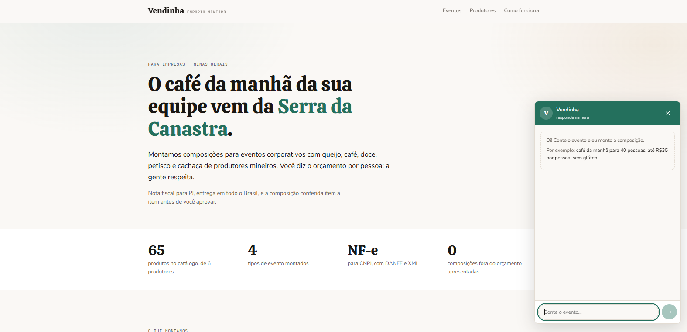
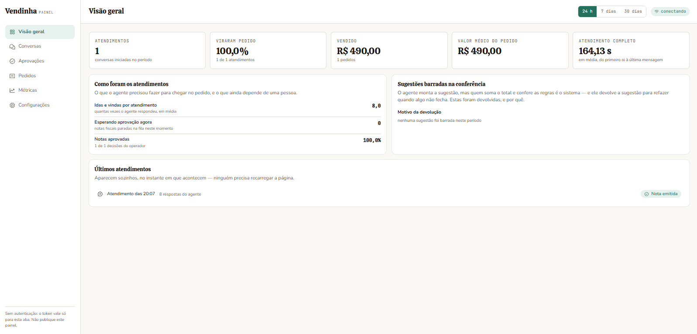
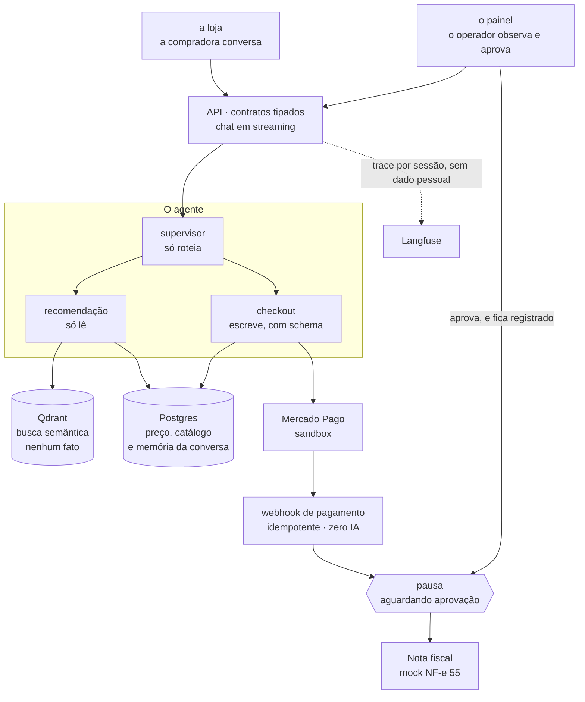

# Vendinha — Agente de Vendas de Ponta a Ponta

> **O LLM decide o que dizer. O código decide o que pode ser feito.**

A **Vendinha** é um empório mineiro digital — queijos, cafés, doces, cachaças, petiscos — que
vende **para empresas**. Quem conversa com o agente é quem organiza o evento: gestora de RH,
office manager, assistente de diretoria. Ela chega com uma tarefa que tem número e vai prestar
contas ao financeiro:

> *"Café da manhã pra 40 pessoas, R$35 por cabeça, tem uma pessoa celíaca no time, e precisa
> chegar antes de quinta."*

Isso não é um pedido de produto: é um **problema de composição**. O agente investiga o evento,
monta a cesta inteira, o código valida orçamento, slots e restrições, e o fluxo segue até o link
de pagamento e a emissão da NF-e — com aprovação humana no meio.

**O case nasceu B2C e virou B2B no meio do projeto.** Com 50 itens no catálogo, "quero um vinho
tinto pra minha sogra" é respondível por inspeção — quem assiste conclui, com razão, que aquilo
é um filtro de e-commerce com skin de chat. Trocar o **comprador** (e não o domínio) foi a
decisão que fez o agente ter razão de existir.

---

## As duas telas

A conversa começa pedindo o **evento**, não o produto:

O painel do operador é read-only e atualiza por stream. Repare em *Sugestões barradas na
conferência*: é a fronteira entre modelo e código exposta como métrica de operação — quantas
composições o código devolveu ao modelo, e por quê.

Num período sem atendimento, conversão e ticket médio aparecem como **traço**, nunca como `0%` —
um painel que exibisse zero estaria afirmando algo falso sobre um dia que não aconteceu.

---

## Arquitetura

Um supervisor roteia e dois subagents executam. A divisão não é organizacional: é uma
**fronteira de permissão**. Das oito tools do registro, só duas escrevem — `criar_pedido` e
`gerar_link_pagamento` — e as duas ficam de um lado só da porta. O subagent de recomendação não
é *proibido* de escrever pelo prompt: ele **não tem** a tool registrada. Isso é propriedade do
código, e é testado.

`validar_composicao` fica na lane que só lê, porque propor não é side effect: ela recebe uma
lista de produtos e devolve um veredito. Quem autoriza é `criar_pedido` — e ele **revalida a
composição do zero no servidor**, em vez de confiar no que já passou pelo modelo.

### Onde a IA entra, e onde ela não entra

| Etapa | Quem resolve |
|---|---|
| Entender o evento ("café pra 40, R$35 por cabeça, um celíaco") | **LLM** — o valor está aqui |
| Escolher os produtos da composição | LLM **ancorado em busca semântica** |
| Validar total, valor por pessoa, slots e alérgenos | **Código — nunca o modelo** |
| Informar preço, calcular total | **Código/banco — nunca o modelo** |
| Confirmar pagamento | Webhook idempotente — **zero IA** |
| Emitir nota fiscal | Só depois de aprovação humana **registrada** |

O humano entra em **um ponto, e só um**: o pedido pausa com o estado persistido, o operador
aprova na fila, e a decisão fica registrada com quem e quando. É impossível, por construção,
emitir nota sem aprovação registrada — e isso é testado, não prometido em prosa.

---

## Stack

| Camada | Escolha | Por quê |
|---|---|---|
| Orquestração | **LangGraph** | a pausa antes da NF é `interrupt` com estado persistido — primitivo, não UX; sobrevive a restart do processo |
| API | **FastAPI** | Pydantic → OpenAPI → cliente TypeScript gerado, e streaming nativo no chat |
| Dados | **PostgreSQL** | fonte da verdade de preço e catálogo, e a memória das conversas |
| Busca | **Qdrant** | catálogo semântico e **nenhum fato**: preço e alérgeno não vivem aqui |
| Observabilidade | **Langfuse Cloud** | trace por sessão desde o primeiro commit, PII mascarada **na origem** |
| Frontend | **React + Vite** | dois consumidores da mesma API: a loja e o painel |
| Pagamento | **Mercado Pago sandbox** | port + adapter, só ambiente de teste, nenhum dinheiro real |
| Documento fiscal | **Mock fiel ao layout NF-e 55** | tarja SEM VALOR FISCAL — certificado e CNPJ ficam fora do caminho |
| Empacotamento | **Docker + compose** | um comando sobe o produto inteiro, tudo mockado |

---

## Qualidade: teste não nasce de cobertura, nasce de risco

Uma matriz declara R1–R10 → mitigação → spec → verificação. **Risco sem verificação é desejo,
não requisito.**

| Camada | A pergunta que responde | Casos |
|---|---|---|
| `tests/unit/` | A função faz a conta certa? | 953 |
| `tests/security/` | Existe caminho de código até a ação proibida? | 97 |

Um teste unitário verde diz que o total foi somado direito. Um teste de segurança verde diz que
a lane de recomendação **não possui** a tool de escrita — não que ela foi instruída a não usá-la.

Além deles, **23 casos de eval** (16 golden + 7 adversariais) escritos **antes do agente
existir**, versionados e protegidos por CODEOWNERS — para que um PR com eval vermelho não fique
verde editando o caso que reprovou. Não há nota agregada nem média: duas famílias de falha
reprovam a suíte inteira — **fato inventado** e **ação fora da allowlist**. O gate roda em
camadas: a parte determinística sempre, as sub-suítes afetadas pelo diff no PR, a suíte inteira
no pós-merge.

---

## O harness

**Claude Code**, com o harness versionado junto do código. O método não é prosa num documento:
é ferramenta que **recusa** em vez de pedir.

- `/escrever-spec` e `/entregar-spec` — uma branch, uma sessão nova, um commit por task
- `/verificar-spec` — o revisor é uma sessão que **nunca viu a implementação**: recebe o id da
  spec e mais nada, e **não tem permissão de corrigir o código**, porque revisor que conserta
  virou autor
- `gate-pr.py` — hook local que **recusa** abrir PR numa branch de spec sem relatório de
  verificação aprovado
- Skills vendorizadas com origem fixada por hash: editar uma à mão reprova o CI

A `main` é protegida e o PR é o único caminho até ela. São duas travas em série, e a de fora — a
proteção de branch no GitHub — é a que não depende de ninguém ter lido nada. Os checks
obrigatórios: `commitlint` · `lint` · `test` · `secrets` · `skills-drift` · `typecheck` ·
`contrato` · `evals`.

---

## As decisões mais difíceis

1. **Preço e total nunca saem do modelo.** Recusei colocar o catálogo no prompt: o agente chama
   uma tool que lê o Postgres na hora de fechar o pedido. O que economizaria uma chamada
   custaria justamente a única coisa que o financeiro do cliente vai conferir.

2. **A restrição não é uma instrução, é a ausência da tool.** A solução óbvia era escrever
   "nunca dê desconto" no prompt — isso some no diff e não garante nada. Segurança por
   arquitetura: o que não está no registro daquela lane não existe.

3. **Trocar o comprador no meio do projeto.** Doeu jogar fora um discovery B2C pronto, mas o
   case B2C não sustentava um agente. Duas specs novas entraram entre as já planejadas, fora da
   ordem dos ids — renumerar sairia mais caro que a nota explicando.

4. **Observabilidade na spec 02, não na 08.** Inversão deliberada da ordem: depurar agente sem
   trace é adivinhação, e o custo de instrumentar depois é reescrever o que já funciona.

### Os medos do cliente, traduzidos

| O medo | O que virou |
|---|---|
| "o agente vai inventar preço" | tool determinística + revalidação no servidor ao criar o pedido |
| "vai vender o que eu não posso entregar" | validador de composição com slots, orçamento e alérgenos |
| "vai emitir nota errada" | HITL obrigatório, com registro de quem aprovou e quando |
| "não vou saber o que aconteceu" | trace por sessão + painel do operador em tempo real |
| "vai vazar dado do meu cliente" | PII mascarada na origem, antes de sair do processo |
| "vai custar caro pra manter" | ambiente único empacotado, tudo mockado, um comando pra subir |

---

## O que eu aprendi

Que **a arquitetura é a parte fácil**. Ela cai por gravidade depois que você decide o que o
modelo **não** tem permissão de fazer — e essa decisão vem da matriz de riscos, não do framework
da moda.

O que mais me custou foi aceitar que risco sem verificação automatizada é desejo, não requisito:
enquanto o eval não estava no CI bloqueando merge, o documento envelhecia em silêncio dizendo
que estava tudo mitigado.

E a lição que eu não esperava: **o discovery é o entregável**. Perdi tempo construindo em cima
de um comprador que não precisava de um agente. Nenhuma decisão técnica boa consertaria isso —
só refazer a pergunta sobre quem está do outro lado da conversa.

---

> A conversa é do atendente. A conta, o corte e o documento são do sistema.
> E a palavra final continua sendo da sua equipe.

📦 **Repositório completo, com PRD, ADRs, specs e runbook:**
[suajornadadedados/vendinha-jornada](https://github.com/suajornadadedados/vendinha-jornada)
